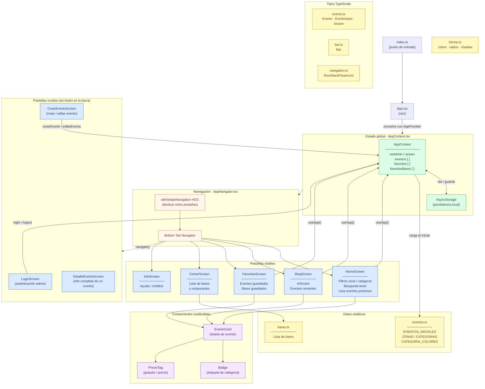

# Arquitectura — Granada Eventos

---

## Resumen de capas

| Capa | Archivos | Responsabilidad |
|------|----------|-----------------|
| **Entrada** | `index.ts` → `App.tsx` | Arranca la app y monta el provider |
| **Estado global** | `AppContext.tsx` | Gestiona eventos, favoritos, sesión y persiste en AsyncStorage |
| **Navegación** | `AppNavigator.tsx` | Bottom tabs + HOC de deslizamiento entre pestañas |
| **Pantallas (tabs)** | `HomeScreen`, `BlogScreen`, `FavoritosScreen`, `ComerScreen`, `InfoScreen` | Vistas principales accesibles desde la barra |
| **Pantallas ocultas** | `LoginScreen`, `DetalleEventoScreen`, `CrearEventoScreen` | Se accede con `navigate()`, sin botón en la barra |
| **Componentes** | `EventoCard`, `Badge`, `PrecioTag` | UI reutilizable entre pantallas |
| **Datos** | `eventos.ts`, `bares.ts` | Datos iniciales estáticos |
| **Tipos** | `evento.ts`, `bar.ts`, `navigation.ts` | Contratos TypeScript |
| **Estilos** | `theme.ts` | Colores, radios y sombras compartidos |
