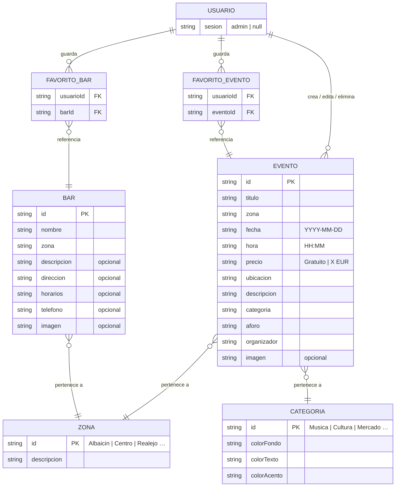

# Figura 4: Diagrama Entidad-Relación — Granada Eventos

---

## Descripción de entidades

| Entidad | Descripción |
|---------|-------------|
| **USUARIO** | Sesión activa en la app. Solo existe el rol `admin`; el usuario anónimo tiene `sesion = null`. |
| **EVENTO** | Evento cultural de Granada. El `id` se genera con `Date.now()` al crear uno nuevo. |
| **BAR** | Bar o restaurante listado en la pestaña Comer. |
| **ZONA** | Barrio de Granada (Albaicín, Centro, Realejo…). Actúa como catálogo compartido entre eventos y bares. |
| **CATEGORIA** | Tipo de evento (Música, Cultura, Mercado…). Incluye la paleta de colores asociada. |
| **FAVORITO_EVENTO** | Relación N:M resuelta como lista de IDs en `AsyncStorage`. |
| **FAVORITO_BAR** | Igual que anterior pero para bares. |

## Cardinalidades clave

- Un **usuario** puede guardar **0 o muchos** eventos favoritos.
- Un **usuario** puede guardar **0 o muchos** bares favoritos.
- Un **usuario admin** puede crear, editar y eliminar **0 o muchos** eventos.
- Cada **evento** pertenece a exactamente **1 zona** y **1 categoría**.
- Cada **bar** pertenece a exactamente **1 zona**.
- Una **zona** o **categoría** puede agrupar **0 o muchos** eventos/bares.
