# Figura 5: Diagrama de roles y permisos — Granada Eventos

```mermaid
%%{init: {'flowchart': {'nodeSpacing': 50, 'rankSpacing': 80}}}%%
flowchart LR

    %% ── AUTENTICACION ────────────────────────────────────────────────
    subgraph AUTH["Autenticacion"]
        direction TB
        ANON(["Usuario Anonimo — sesion = null"])
        LOGIN["LoginScreen — usuario: admin / contrasena: granada2025"]
        ADMIN(["Administrador — sesion = 'admin'"])

        ANON -->|"pulsa Login"| LOGIN
        LOGIN -->|"credenciales correctas"| ADMIN
        LOGIN -->|"credenciales incorrectas"| ANON
        ADMIN -->|"logout"| ANON
    end

    %% ── PERMISOS COMPARTIDOS ─────────────────────────────────────────
    subgraph COMUN["Acciones disponibles para todos los usuarios"]
        direction TB
        P1["Ver listado de eventos proximos (HomeScreen)"]
        P2["Buscar eventos por texto"]
        P3["Filtrar eventos por zona y categoria"]
        P4["Ver detalle completo de un evento (DetalleEventoScreen)"]
        P5["Guardar y quitar favoritos de eventos (FavoritosScreen)"]
        P6["Ver bares y restaurantes (ComerScreen)"]
        P7["Guardar y quitar favoritos de bares"]
        P8["Ver blog y eventos recientes (BlogScreen)"]
        P9["Ver ayuda e informacion (InfoScreen)"]
    end

    %% ── PERMISOS EXCLUSIVOS ADMIN ────────────────────────────────────
    subgraph ADMIN_PERMS["Acciones exclusivas del Administrador"]
        direction TB
        A1["Crear nuevo evento (CrearEventoScreen)"]
        A2["Editar evento existente (CrearEventoScreen con parametro)"]
        A3["Eliminar evento (con confirmacion mediante Alert)"]
        A4["Cerrar sesion (boton Salir en HomeScreen)"]
    end

    %% ── CONEXIONES ───────────────────────────────────────────────────
    ANON --> COMUN
    ADMIN --> COMUN
    ADMIN --> ADMIN_PERMS

    %% ── ESTILOS ──────────────────────────────────────────────────────
    classDef roleAnon  fill:#e0f2fe,stroke:#0284c7,color:#0c4a6e
    classDef roleAdmin fill:#dcfce7,stroke:#16a34a,color:#14532d
    classDef accion    fill:#fff7ed,stroke:#ea580c,color:#7c2d12
    classDef accionAdm fill:#fce7f3,stroke:#be185d,color:#831843
    classDef auth      fill:#f8fafc,stroke:#94a3b8,color:#475569

    class ANON roleAnon
    class ADMIN roleAdmin
    class LOGIN auth
    class P1,P2,P3,P4,P5,P6,P7,P8,P9 accion
    class A1,A2,A3,A4 accionAdm
```

---

## Matriz de permisos

| Accion | Usuario Anonimo | Administrador |
|--------|:--------------:|:-------------:|
| Ver listado de eventos | Si | Si |
| Buscar y filtrar eventos | Si | Si |
| Ver detalle de un evento | Si | Si |
| Guardar favoritos de eventos | Si | Si |
| Guardar favoritos de bares | Si | Si |
| Ver blog | Si | Si |
| Ver bares y restaurantes | Si | Si |
| Ver ayuda e info | Si | Si |
| **Crear evento** | No | Si |
| **Editar evento** | No | Si |
| **Eliminar evento** | No | Si |
| **Cerrar sesion** | No | Si |

## Notas de implementacion

- La sesion **no persiste** entre reinicios de la app: al cerrar, se vuelve al estado anonimo.
- Las credenciales estan definidas en `AppContext.tsx` como constante `ADMIN_CREDENTIALS`.
- El boton de creacion de evento en `HomeScreen` y los botones de editar/eliminar en `DetalleEventoScreen` solo se renderizan si `esAdmin === true`.
- Los favoritos **si persisten** en `AsyncStorage` independientemente del rol.
